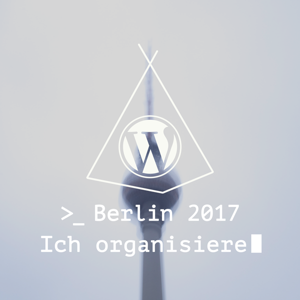

# Website Badges #wcber17

Get #wcber17 badges for your website (or social media et.al.).

There are several combinations to pick from (all German ftm):

* animated gif and (static) png
* 5 different backgrounds
* Static badges for Attendees, Organizers, Speakers, Sponsors (singular and plural), Volunteers

## How to use

## Animated

## Attendees

## Organizers

## Speakers

## Sponsors

### Singular

### Plural

## Volunteers

## License

The badges are licensed under [CC0](https://creativecommons.org/publicdomain/zero/1.0/). 
The original background images have been licensed under [CC 4.0 BY-NC-SA](https://creativecommons.org/licenses/by-nc-sa/4.0/) by [Alexander Goller](https://alexandergoller.com).  
Specific rights of use have been granted to WordCamp Berlin, allowing the badges to be distributed under a CC0 license.

### Want to create your own version?
Make sure you have [`git lfs`](https://git-lfs.github.com/) installed.  
Clone this repository.  
For static pngs use `src/badges.psd` for animated gifs use `src/badges.aep` and adapt to your liking. 

__We would greatly appreciate a pull request on this repository with all new, translated or updated badges.__ 
